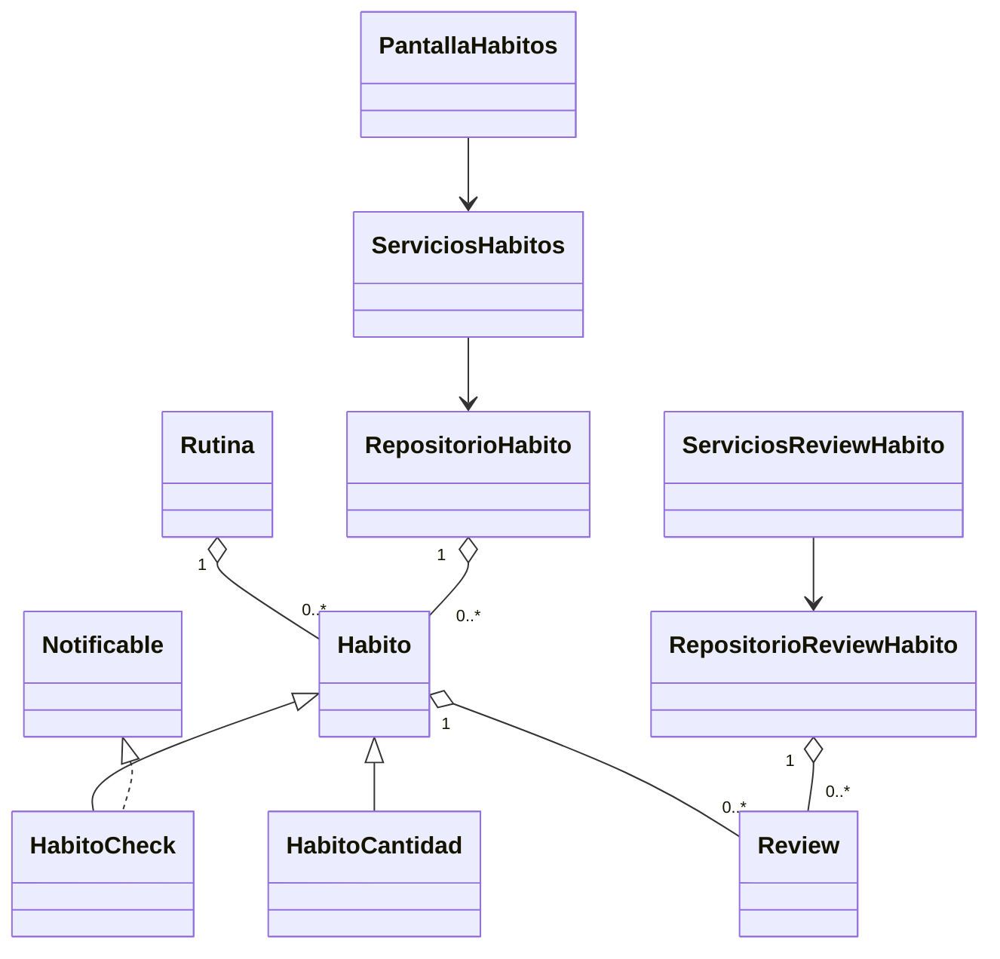
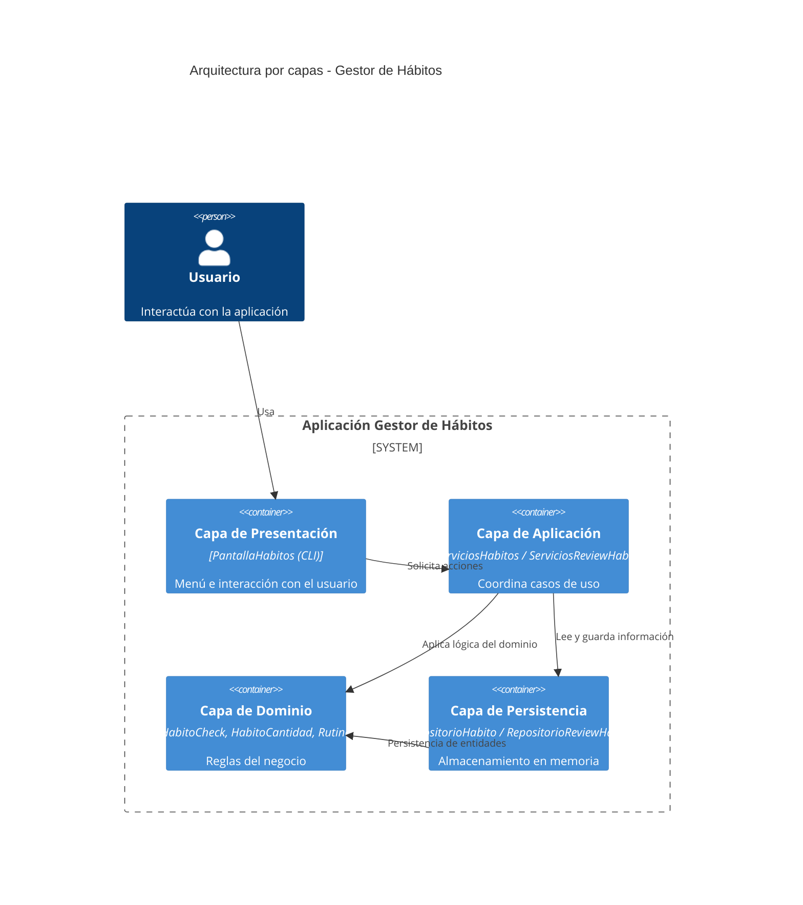

# Sistema de Gestión de Hábitos

Aplicación de consola para gestionar hábitos, rutinas y valoraciones, con separación por capas (`entidades`, `servicios`, `persistencia`, `ui`).

---

## Objetivo del proyecto

Este proyecto implementa un sistema de gestión de hábitos con foco en:

- modelado orientado a objetos y encapsulación  
- uso de herencia (clase abstracta `Habito` y sus variantes)  
- polimorfismo en métodos como `cumplido()` y `notificar()`  
- separación de responsabilidades mediante arquitectura en 4 capas  
- gestión de datos mediante repositorios en memoria  
- interacción con el usuario a través de una interfaz de consola  

---

## Estructura del Proyecto

```

trabajo-final-b6/
│
├── Entidades/
│   ├── Habito.py
│   ├── HabitoCheck.py
│   ├── HabitoCantidad.py
│   ├── Rutina.py
│   ├── ReviewHabito.py
│   └── Notificable.py
│
├── Persistencia/
│   ├── RepositorioHabito.py
│   └── RepositorioReviewHabito.py
│
├── Servicios/
│   ├── ServiciosHabitos.py
│   └── ServiciosReviewHabito.py
│
├── UI/
│   └── PantallaHabitos.py
│
├── main.py
├── README.md
└── requirements.txt

```


* **Entidades**: contienen las clases principales del sistema (hábitos, rutinas y reviews).
* **Persistencia**: se encarga de almacenar los datos en memoria mediante repositorios.
* **Servicios**: incluye la lógica de negocio, actuando como intermediario entre la UI y los datos.
* **UI**: menú interactivo que permite al usuario utilizar la aplicación desde consola.

---

## Funcionalidades

* Crear hábitos de tipo check (completado o no) o de cantidad (con objetivo).
* Consultar todos los hábitos y eliminarlos si es necesario.
* Crear rutinas y agrupar hábitos dentro de ellas.
* Añadir reviews a los hábitos para valorar su progreso.
* Consultar las reviews almacenadas en el sistema.

---
 
## Notas
* Se ha utilizado programación orientada a objetos para modelar el problema.
* Se aplican conceptos como herencia, encapsulación y clases abstractas.
* El código está organizado en capas para mejorar su mantenimiento.
* Se incluyen validaciones básicas para evitar errores en la entrada de datos.
 
---

## Ejemplo de ejecución senncillo

```
---[MENÚ DE HÁBITOS]---
1. Crear hábito
2. Ver todos los hábitos
...
Elige una opción: 1

¿Qué tipo de hábito?
1. Check (sí/no)
2. Cantidad (con objetivo)
Tipo: 2

ID del hábito: H1
Nombre: Beber agua
Frecuencia: diario
Nivel de importancia: 3
Objetivo: 8

Hábito 'Beber agua' creado correctamente.

---[MENÚ DE HÁBITOS]---
Elige una opción: 2

---[HÁBITOS]---
Cantidad: Beber agua (diario) - 0/8 - En progreso
```
---

## Diagrama UML de clases (Mermaid)



---

## Diagrama de arquitectura C4 (Mermaid)



---
 
## Estado
Primera versión funcional del proyecto, con todas las funcionalidades principales implementadas.

---