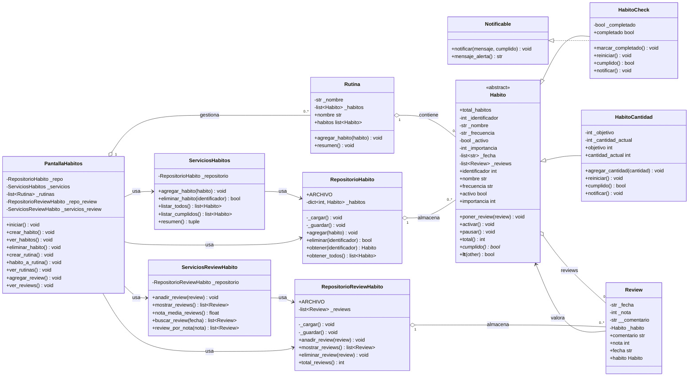
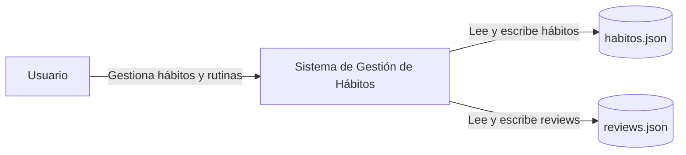
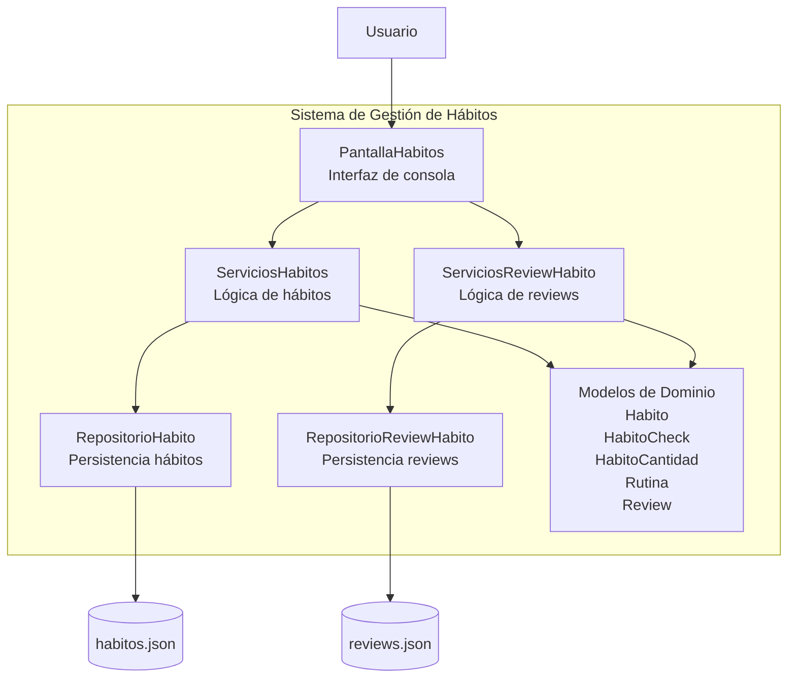

# Sistema de Gestión de Hábitos

Aplicación de consola para gestionar hábitos, rutinas y valoraciones, con separación por capas (`Entidades`, `Servicios`, `Persistencia`, `UI`) y uso de Programación Orientada a Objetos.

---

# Objetivo del proyecto

Este proyecto implementa un sistema académico de gestión de hábitos y bienestar con foco en:

- modelado orientado a objetos y encapsulación
- uso de herencia mediante la clase abstracta `Habito` y sus variantes
- polimorfismo en métodos como `cumplido()` y `notificar()`
- separación de responsabilidades mediante arquitectura en 4 capas
- validación de datos y gestión de excepciones propias
- uso de repositorios para gestionar los datos de la aplicación
- interacción con el usuario mediante una interfaz de consola

El proyecto se basa en la propuesta 21, **Hábitos y bienestar**, cuyo objetivo es realizar un seguimiento de rutinas, metas y tipos de hábitos con reglas diferenciadas.

---

# Requisitos

- Python 3.12 o superior
- Entorno virtual recomendado

---

# Instalación rápida

```bash
python3 -m venv .venv
source .venv/bin/activate
python -m pip install -U pip
```

Si existe el archivo `requirements.txt`, se pueden instalar las dependencias con:

```bash
python -m pip install -r requirements.txt
```

---

# Cómo ejecutar la aplicación

```bash
python main.py
```

`main.py` construye los repositorios, servicios y lanza la interfaz de consola definida en `UI/PantallaHabitos.py`.

---

# Estructura del proyecto

```text
trabajo-final-b6/
│
├── Entidades/
│   ├── Habito.py
│   ├── HabitoCheck.py
│   ├── HabitoCantidad.py
│   ├── Rutina.py
│   ├── ReviewHabito.py
│   └── Notificable.py
│
├── Persistencia/
│   ├── RepositorioHabito.py
│   └── RepositorioReviewHabito.py
│
├── Servicios/
│   ├── ServiciosHabitos.py
│   └── ServiciosReviewHabito.py
│
├── UI/
│   └── PantallaHabitos.py
│
├── main.py
├── README.md
└── requirements.txt
```

---

# Responsabilidades por capa

Regla arquitectónica principal:

```text
UI -> Servicios -> Persistencia / Entidades
```

## Entidades

Contienen las clases principales del dominio:

- hábitos
- rutinas
- reviews
- validaciones internas
- herencia
- polimorfismo
- encapsulación

## Servicios

Actúan como intermediarios entre la interfaz y los datos. Incluyen la lógica de aplicación para:

- crear hábitos
- listar hábitos
- eliminar hábitos
- gestionar reviews
- calcular información derivada

## Persistencia

Contiene los repositorios encargados de almacenar y recuperar los objetos de la aplicación.

Actualmente, se utilizan repositorios en memoria, dejando la estructura preparada para añadir persistencia en ficheros.

## UI

Contiene la interfaz de consola. Su responsabilidad es pedir datos al usuario, mostrar mensajes y llamar a los servicios correspondientes.

---

# Funcionalidades

La aplicación permite:

- crear hábitos de tipo check
- crear hábitos de tipo cantidad
- consultar todos los hábitos registrados
- eliminar hábitos
- crear rutinas y agrupar hábitos
- añadir reviews a los hábitos
- consultar las reviews almacenadas
- activar y pausar hábitos
- comprobar el cumplimiento de un hábito

---

# Reglas de dominio principales

- `Habito` es una clase abstracta que define la estructura común de todos los hábitos.
- `HabitoCheck` representa hábitos que se cumplen o no se cumplen.
- `HabitoCantidad` representa hábitos con un objetivo numérico.
- `Rutina` permite agrupar varios hábitos.
- `Review` permite valorar un hábito con fecha, nota y comentario.
- La importancia de un hábito debe estar entre 1 y 5.
- La frecuencia solo puede ser `diario`, `semanal` o `mensual`.
- La nota de una review debe estar entre 0 y 10.
- No se permiten nombres, fechas o comentarios vacíos.

---

# Conceptos de Programación Orientada a Objetos utilizados

## Clases y objetos

El sistema se organiza mediante clases como `Habito`, `HabitoCheck`, `HabitoCantidad`, `Rutina` y `Review`.

## Encapsulación

Se usan atributos protegidos y privados para controlar el acceso a los datos:

```text
_identificador
_activo
__comentario
```

## Herencia

`HabitoCheck` y `HabitoCantidad` heredan de `Habito`.

```text
Habito
├── HabitoCheck
└── HabitoCantidad
```

## Polimorfismo

Cada tipo de hábito puede implementar el método `cumplido()` según sus propias reglas.

## Clases abstractas

La clase `Habito` utiliza `ABC` y `@abstractmethod` para obligar a las clases hijas a implementar ciertos métodos.

## Sobrecarga de operadores

Se utiliza sobrecarga para comparar hábitos, por ejemplo mediante `__lt__`, comparando su importancia.

---

# Gestión de excepciones

El proyecto incluye validaciones y excepciones para controlar errores como:

- importancia fuera de rango
- frecuencia inválida
- nombre vacío
- nota inválida
- comentario vacío
- fecha inválida
- tipo de dato incorrecto

Esto evita que se creen objetos con estados incoherentes.

---

# Ejemplo rápido de uso

```python
from Entidades.HabitoCheck import HabitoCheck

habito = HabitoCheck(
    identificador=1,
    nombre="Hacer ejercicio",
    frecuencia="diario",
    importancia=5
)

print(habito)
```

---

# Ejemplo de review

```python
from Entidades.HabitoCheck import HabitoCheck
from Entidades.ReviewHabito import Review

habito = HabitoCheck(
    identificador=1,
    nombre="Hacer ejercicio",
    frecuencia="diario",
    importancia=5
)

review = Review(
    fecha="2026-05-15",
    nota=9,
    comentario="Buen progreso durante la semana",
    habito=habito
)

habito.poner_review(review)
```

---

# Notas

- El código está organizado siguiendo una arquitectura por capas.
- Las entidades contienen las reglas principales del dominio.
- Los servicios coordinan las operaciones de la aplicación.
- La UI se limita a interactuar con el usuario.
- El proyecto aplica conceptos vistos en Programación II: clases, objetos, herencia, encapsulación, polimorfismo, clases abstractas, excepciones y sobrecarga de operadores.

---

# Diagrama UML de clases (Mermaid)



---

# Diagrama de arquitectura C4 (Mermaid)

# Diagrama C4 — Nivel 1 (Contexto)



---

# Diagrama C4 — Nivel 2 (Contenedores)

